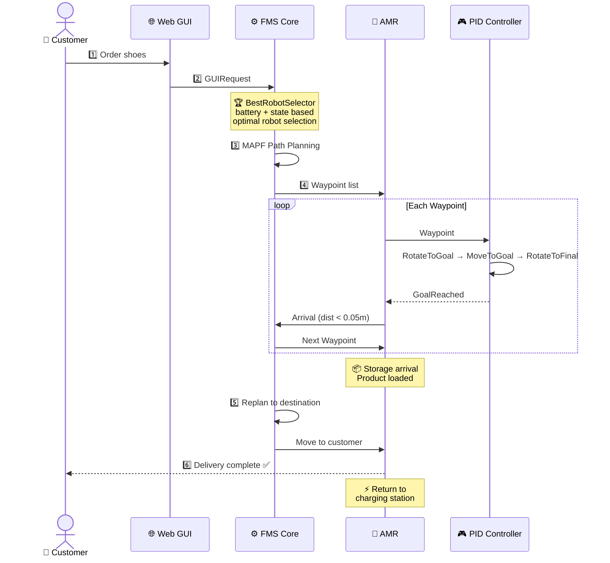
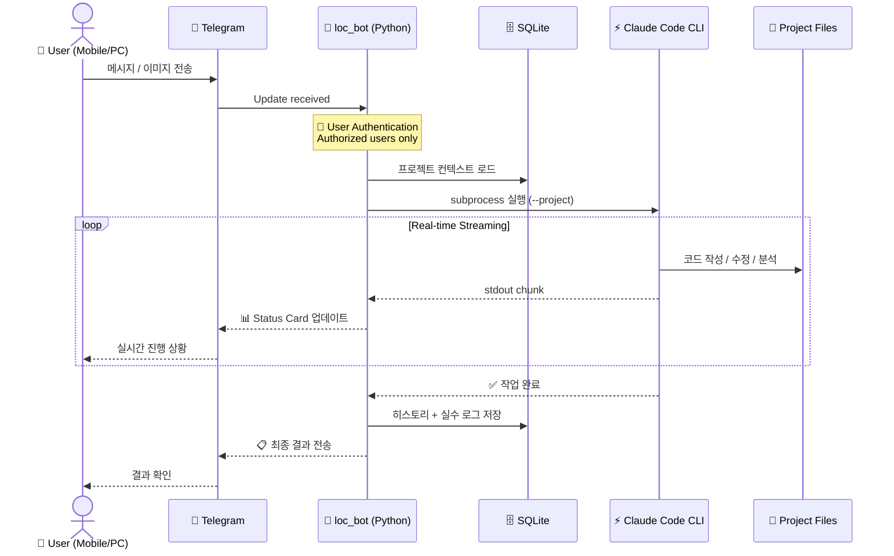
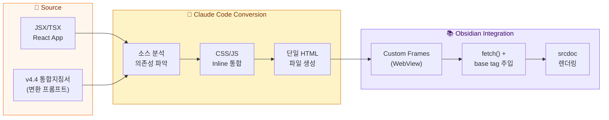
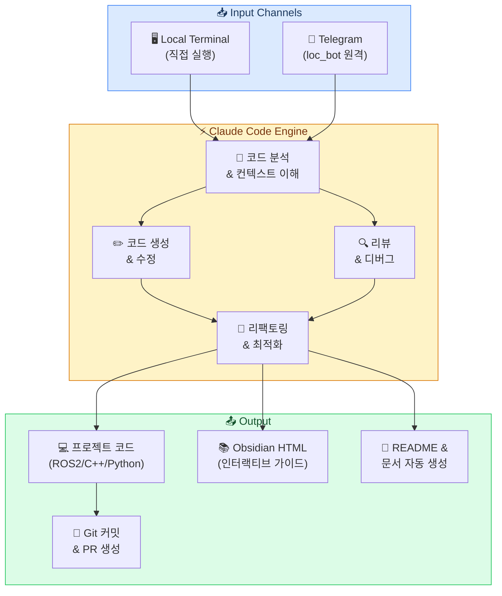

<div align="center">

<!-- Animated Header -->


<!-- Typing Animation -->
<a href="https://git.io/typing-svg">
  
</a>

<br/>

<!-- Animated Wave -->


<br/><br/>


</div>

---

<div align="center">

## About Me

</div>


```python
class RoboticsEngineer:
    def __init__(self):
        self.role = "Undergraduate Researcher"
        self.major = "Electronic Engineering"

        self.skills = {
            "robotics": ["ROS2", "Robot Arm", "MAPF", "FMS"],
            "autonomous": ["PID", "DQN", "Vision Nav", "SLAM"],
            "ai_vision": ["OpenCV", "OCR", "ArUco", "Depth"],
            "backend": ["Django", "Telegram Bot", "SQLite"],
            "ai_tools": ["Claude Code", "Claude API"],
            "languages": ["C++", "Python"],
        }

        self.current = "Smart Store Robot Automation"
        self.passion = "Real-world Robotic Systems"
        self.powered_by = "Claude Code"

    def motto(self):
        return "코드로 로봇을 움직인다"

me = RoboticsEngineer()
```

<br clear="right"/>

---

<!-- Divider -->
<div align="center">

</div>

## Tech Stack

<div align="center">

### Robotics & Autonomous Driving


### Languages


### AI / Machine Learning


### Backend & Tools


### Quantum Computing


### AI-Powered Development


</div>

---

<!-- Divider -->
<div align="center">

</div>

## Projects

<!-- Project 1: RoboCallee -->
<div align="center">

### RoboCallee - Smart Store Robot Automation


</div>

> **스마트 신발 매장에서 로봇팔 + 자율주행 로봇으로 재고 운반과 고객 응대를 자동화하는 시스템**

<table>
<tr>
<td width="50%">

**Robot Arm Control**
- MyCobot Pick & Place 제어
- OCR 기반 신발 박스 인식
- Shelf ↔ Buffer ↔ Robot 자동 이송
- 카메라-로봇팔 캘리브레이션

</td>
<td width="50%">

**Autonomous Driving**
- ArUco 마커 기반 위치 추정 (LPF)
- MAPF 다중 로봇 경로 탐색
- PID 제어 기반 네비게이션
- DQN 강화학습 주행 (Gazebo → Sim2Real)

</td>
</tr>
<tr>
<td width="50%">

**Fleet Management System**
- 배달/수거 시나리오 자동화
- 다중 로봇 트래픽 관리
- 태스크 할당 및 상태 관리
- ROS2 기반 실시간 통신

</td>
<td width="50%">

**Control Service**
- Django 기반 고객 GUI
- 관리자 Web GUI + QT GUI
- Vision 기반 장애물 회피
- 실시간 로봇 상태 모니터링

</td>
</tr>
</table>

<div align="center">

**Demo Videos**

[](https://www.youtube.com/watch?v=GBW1qsYFHe4)
[](https://www.youtube.com/watch?v=zXWMFyJrSFo)
[](https://www.youtube.com/watch?v=mT-UyDo27II)
[](https://youtu.be/zxgvcNaVX5w)

</div>

<!-- Autonomous Driving Deep Dive -->
<div align="center">


<br/>

<!-- Section Banner -->


<br/>

<a href="https://git.io/typing-svg"></a>

<br/>


<sub><b>3 AMR Simultaneous Autonomous Driving — MAPF Path Planning + PID Navigation</b></sub>

<br/><br/>


</div>


<details open>
<summary><h4>🎮 PID Navigation State Machine</h4></summary>

<div align="center">

> Nav2 대신 직접 구현 — **FMS Waypoint 단위 통합에 최적화**된 경량 제어기

<br/>


<sub><b>Navigation State Machine in action</b></sub>

</div>

<br/>

**P Control vs PID Control Comparison**

<div align="center">

<table>
<tr>
<td width="50%" align="center">

<br/>
<sub><b>❌ P control only</b> — overshoot, oscillation</sub>
</td>
<td width="50%" align="center">

<br/>
<sub><b>✅ PID control</b> — stable convergence</sub>
</td>
</tr>
</table>

</div>

<br/>

<div align="center">


</div>

<br/>

**🎛️ Real-time PID Tuning**

<div align="center">


<sub><b>Qt GUI — adjust PID gains while the robot is running</b></sub>

</div>

<details>
<summary><b>📜 PID Controller Code (Python) — Click to expand</b></summary>

<br/>

```python
class MoveToGoalPID(Node):
    def __init__(self):
        super().__init__('move_to_goal_pid')
        # ROS2 Parameter Server — live tuning enabled
        self.declare_parameter('angular_kp', 2.0)
        self.declare_parameter('angular_ki', 0.0)
        self.declare_parameter('angular_kd', 0.1)
        self.declare_parameter('linear_kp', 0.5)
        self.declare_parameter('windup_limit', 1.0)
        self.add_on_set_parameters_callback(self.param_callback)

    def compute_angular_pid(self, error, dt):
        self.integral += error * dt
        self.integral = max(-self.windup_limit,          # Anti-Windup
                       min(self.windup_limit, self.integral))
        derivative = (error - self.prev_error) / dt
        self.prev_error = error
        return self.kp * error + self.ki * self.integral + self.kd * derivative

    def param_callback(self, params):
        """Change PID gains at runtime via ROS2 param set"""
        for p in params:
            setattr(self, p.name, p.value)
        return SetParametersResult(successful=True)
```

```bash
# Live tuning from terminal
ros2 param set /move_to_goal_pid angular_kp 3.0
ros2 param set /move_to_goal_pid angular_kd 0.2
```

</details>

</details>

---

<details open>
<summary><h4>🔄 AMR End-to-End Workflow</h4></summary>




</details>

---

<div align="center">

**🏆 Technical Achievements**

<table>
<tr>
<td align="center" width="25%">

### 🎮
**PID Control**
Real-time Tuning
Stable Convergence

</td>
<td align="center" width="25%">

### 🗺️
**MAPF**
3 AMR Collision-free
Path Planning

</td>
<td align="center" width="25%">

### ⚡
**Nav2 Replace**
Lightweight
FMS-optimized
Waypoint tracking

</td>
<td align="center" width="25%">

### ⚙️
**FMS Core**
Multi-robot
State Machine

</td>
</tr>
</table>

<br/>

**💡 Key Takeaways**

</div>

| | Topic | Insight |
|:---:|:---:|:---|
| 🎛️ | **PID Tuning** | Theoretical gains vs real-robot optimal gains differ greatly; **real-time tuning infrastructure** is essential |
| 🔧 | **Integration** | Interface design between path planner → controller → hardware is **critical** for system stability |
| 🤖 | **Nav2 vs Custom** | Evaluated framework trade-offs; chose **project-fit over convenience** |

<div align="center">

<br/>

[](https://github.com/lee6147/Undergraduate-research-student)
[](https://github.com/addinedu-roscamp-5th/roscamp-repo-3)

</div>

---

<!-- Project 2: loc_bot -->
<div align="center">

### loc_bot - Telegram Remote Claude Code Controller


</div>

> **Telegram을 통해 로컬 PC의 Claude Code CLI를 어디서든 원격 제어하는 봇**

<table>
<tr>
<td width="50%">

- Telegram 메시지로 Claude Code CLI 원격 제어
- 실시간 스트리밍 출력 (Status Card)
- 다중 프로젝트 관리 (`/register`, `/use`, `/scan`)
- 이미지 첨부 → Claude에게 전달

</td>
<td width="50%">

- 작업 히스토리 저장 (SQLite)
- 실수 로그 기록 및 검색
- 사용자 인증 시스템
- Windows 자동 시작 스크립트

</td>
</tr>
</table>

<div align="center">

[](https://github.com/lee6147/Undergraduate-research-student/tree/main/Claude/loc_bot)

</div>

---

<!-- Project 3: Quantum BQB -->
<div align="center">

<!-- Quantum Section Header -->


<br/>

<a href="https://git.io/typing-svg">
  
</a>

<br/>


&nbsp;

&nbsp;


<br/>


&nbsp;


<br/><br/>


</div>

> **BQB(Buried Quantum Barrier) 기반 반도체 큐비트 대규모 어레이 기술을 인터랙티브 웹 플랫폼으로 구축한 연구 프로젝트**

</details>

---

<div align="center">

**🏆 Technical Achievements**

<table>
<tr>
<td align="center" width="20%">

### ⚛️
**BQB Architecture**
Triple-Wall QBQ
Qubit Protection
Si-28 + P-31

</td>
<td align="center" width="20%">

### 📐
**Yield Scaling**
p^N² Law
Overlay ≤ 15nm
Closed-Loop QC

</td>
<td align="center" width="20%">

### 🧊
**DD-IC Control**
77K Cryogenic
√N Fan-out
256 → 16 Lines

</td>
<td align="center" width="20%">

### 🎓
**Learning Platform**
7 Visualizations
3-Level Guides
239KB React App

</td>
<td align="center" width="20%">

### 🎯
**Fidelity Target**
F1q ≥ 99.9%
F2q ≥ 99%
T2 ≥ 1s

</td>
</tr>
</table>

<br/>

**💡 Key Takeaways**

</div>

| | Topic | Insight |
|:---:|:---:|:---|
| ⚛️ | **Scalability** | 큐비트 수가 늘수록 수율이 지수적으로 떨어짐 — **p^N² law**에 기반한 공정 정밀도가 핵심 |
| 🛡️ | **Triple-Wall** | 물리적·전기적·양자적 3중 격리 없이는 대규모 어레이에서 **crosstalk** 제어 불가 |
| 🧊 | **Cryogenics** | 상온→77K→20mK 3단계 온도에서 **Fan-out √N** 압축이 배선 병목 해결의 열쇠 |
| 🎓 | **Visualization** | 추상적 양자 개념을 **인터랙티브 웹 시각화**로 변환하여 학습 효과 극대화 |

<div align="center">

<br/>


<br/>

[](https://github.com/lee6147/Undergraduate-research-student/tree/main/Quantum_BQB)
[](https://github.com/lee6147/Undergraduate-research-student/tree/main/Quantum_BQB)

</div>

---
<!-- Project 4: R&D Center -->
<div align="center">

### R&D Center Establishment Strategy


</div>

> **ERC/CRC 선도연구센터지원사업 제안서를 인터랙티브 웹페이지로 시각화**

- 3단계 5년 로드맵 (기반 구축 → 본격 연구 → 사업화)
- 스크롤 기반 인터랙션, 카운터 애니메이션, 패럴랙스 효과
- 핵심 메시지: *"이 컨소시엄이 아니면 이 문제를 못 푼다"*

<div align="center">

[](https://github.com/lee6147/Undergraduate-research-student/tree/main/Eletric%20bus)

</div>

---


<!-- Claude Code Divider -->
<div align="center">

</div>

## Powered by Claude Code

<div align="center">

<!-- Claude Code Header -->


<br/>

<a href="https://git.io/typing-svg">
  
</a>

<br/>


</div>

> **Claude Code는 단순한 도구가 아닌, 내 개발 워크플로우의 핵심 파트너입니다.**

---

<details open>
<summary><h4>🤖 loc_bot — Telegram Remote Development System</h4></summary>

<div align="center">

> 어디서든 Telegram으로 Claude Code CLI를 원격 제어하여 코드를 작성·리뷰·디버그하는 시스템

</div>

<br/>



<br/>

<table>
<tr>
<td width="50%">

**Core Features**
```
📱 Telegram Remote Control
├── /register — 프로젝트 등록
├── /use — 프로젝트 전환
├── /scan — 자동 탐색
├── /history — 작업 이력
└── /mistakes — 실수 로그

🔄 Real-time Streaming
├── Status Card (진행률)
├── stdout chunk 전달
└── 긴 출력 자동 분할

📎 Attachment Support
├── 이미지 → Claude Vision
├── 파일 → 컨텍스트 전달
└── 스크린샷 디버깅
```

</td>
<td width="50%">

**Architecture**
```
Telegram API
    ↓
loc_bot (Python)
├── auth_manager.py    — 사용자 인증
├── project_manager.py — 다중 프로젝트
├── claude_runner.py   — CLI subprocess
├── stream_handler.py  — 실시간 스트리밍
├── history_db.py      — SQLite 히스토리
└── mistake_logger.py  — 실수 기록
    ↓
Claude Code CLI
    ↓
코드 작성 / 수정 / 리뷰
    ↓
실시간 결과 → Telegram
```

</td>
</tr>
</table>

<details>
<summary><b>📜 loc_bot Core Implementation (Python) — Click to expand</b></summary>

<br/>

```python
class ClaudeCodeBot:
    def __init__(self):
        self.app = Application.builder().token(BOT_TOKEN).build()
        self.db = HistoryDB("work_history.db")
        self.projects = ProjectManager()

    async def handle_message(self, update, context):
        user_id = update.effective_user.id
        if not self.is_authorized(user_id):
            return  # 🔐 인증된 사용자만

        project = self.projects.get_active(user_id)
        prompt = update.message.text

        # 📎 이미지 첨부 처리
        if update.message.photo:
            image_path = await self.download_image(update)
            prompt = f"[Image: {image_path}] {prompt}"

        # ⚡ Claude Code CLI 실행 + 스트리밍
        status_msg = await update.message.reply_text("🔄 Processing...")
        async for chunk in self.run_claude(project, prompt):
            await status_msg.edit_text(
                f"📊 **Status Card**\n```\n{chunk}\n```",
                parse_mode="Markdown"
            )

        # 🗄️ 히스토리 저장
        self.db.save(user_id, project, prompt, chunk)
```

```python
class ProjectManager:
    """다중 프로젝트 관리 — 프로젝트 간 자유 전환"""

    def register(self, user_id, path, name):
        """프로젝트 등록 (/register)"""
        self.db.insert(user_id, path, name)

    def scan(self, base_path):
        """Git 프로젝트 자동 탐색 (/scan)"""
        return [p for p in Path(base_path).rglob(".git")]

    def use(self, user_id, name):
        """활성 프로젝트 전환 (/use)"""
        self.active[user_id] = self.db.get(user_id, name)
```

</details>

</details>

---

<details open>
<summary><h4>📚 Obsidian HTML Pipeline — Knowledge Visualization</h4></summary>

<div align="center">

> JSX/TSX React 앱을 Obsidian에서 바로 열 수 있는 단일 HTML로 자동 변환하는 파이프라인

</div>

<br/>



<br/>

<div align="center">

**🛡️ WebView iframe Security Bypass Pattern**

```
  ❌ 문제: WebView 중첩 iframe에서 file:// src 로드 차단

  ┌──────────────────────────────────────────────────────┐
  │  Custom Frames (Electron WebView)                     │
  │                                                       │
  │   <iframe src="file://app.html">                      │
  │     └── <iframe src="file://guide.html"> ← 차단! ❌  │
  │           (중첩 file:// 프로토콜 거부)                 │
  │                                                       │
  └──────────────────────────────────────────────────────┘

  ✅ 해결: fetch() + <base> 태그 주입 + srcdoc

  ┌──────────────────────────────────────────────────────┐
  │  Custom Frames (Electron WebView)                     │
  │                                                       │
  │   1. fetch("./guide.html")    ← 상대경로 fetch 허용  │
  │   2. HTML 텍스트 로드                                  │
  │   3. <base href="file://..."> 주입                    │
  │   4. <iframe srcDoc={html}>   ← 정상 렌더링! ✅      │
  │                                                       │
  └──────────────────────────────────────────────────────┘
```

</div>

<br/>

<table>
<tr>
<td width="50%">

**변환 프로세스**
```
1. JSX/TSX 소스 분석
   ├── 컴포넌트 구조 파악
   └── 외부 의존성 목록화

2. 의존성 제거 & 인라인화
   ├── CDN → inline script
   ├── import → 번들링
   └── 이미지 → base64 인코딩

3. CSS/JS 단일 파일 통합
   ├── <style> 태그 통합
   └── <script> 태그 통합

4. Obsidian 호환성 검증
   └── file:// 프로토콜 테스트

5. Custom Frames 자동 등록
   └── data.json 업데이트
```

</td>
<td width="50%">

**핵심 설정 (data.json)**
```json
{
  "frames": [{
    "url": "file:///path/to/app.html",
    "displayName": "BQB Guide",
    "forceIframe": false,
    "padding": 0
  }]
}
```

**Critical Settings:**
```
forceIframe: false
  → WebView 사용 (JS 실행 가능)
  → iframe 대신 Electron WebView

padding: 0
  → 콘텐츠 잘림 방지
  → root 레벨 속성

⚠️ 수정 후 Obsidian 완전 재시작 필수
  → 메모리에 캐시된 설정 갱신
```

</td>
</tr>
</table>

</details>

---

<details open>
<summary><h4>⚡ Claude Code Development Workflow</h4></summary>



<br/>

<div align="center">

**Claude Code 활용 프로젝트 매트릭스**

</div>

| Project | Claude Code 역할 | 주요 활용 |
|:---:|:---|:---|
| **RoboCallee** | FMS C++ 코드 분석, README 생성 | 자율주행 아키텍처 문서화 |
| **Quantum BQB** | 4개 인터랙티브 가이드 전체 생성 | JSX → Obsidian HTML 변환 |
| **loc_bot** | Telegram Bot 전체 개발 | Claude Code로 Claude Code Bot 개발 |
| **Profile README** | 1900줄+ 프로필 자동 생성 | Mermaid, LaTeX, ASCII Art |

<br/>

<table>
<tr>
<td width="25%" align="center">

### ✏️
**Code Generation**
프로젝트 코드
자동 작성
ROS2 / C++ / Python

</td>
<td width="25%" align="center">

### 🔍
**Code Review**
실시간 리뷰
버그 탐지 & 수정
최적화 제안

</td>
<td width="25%" align="center">

### 📚
**HTML Pipeline**
JSX → Obsidian
자동 변환
239KB 단일 파일

</td>
<td width="25%" align="center">

### 📱
**Remote Dev**
Telegram 원격
어디서든 코딩
실시간 스트리밍

</td>
</tr>
</table>

</details>

---

<div align="center">

**🏆 Technical Achievements**

<table>
<tr>
<td align="center" width="20%">

### 📱
**loc_bot**
Telegram 원격 제어
실시간 스트리밍
다중 프로젝트 관리

</td>
<td align="center" width="20%">

### 📚
**Obsidian Pipeline**
JSX → HTML 변환
WebView 보안 해결
Custom Frames 연동

</td>
<td align="center" width="20%">

### ⚡
**AI Workflow**
코드 생성·리뷰
디버그·리팩토링
Git 자동화

</td>
<td align="center" width="20%">

### 🗄️
**Data Management**
SQLite 이력 저장
실수 로그 기록
프로젝트별 관리

</td>
<td align="center" width="20%">

### 🔐
**Security**
사용자 인증
권한 관리
안전한 CLI 실행

</td>
</tr>
</table>

<br/>

**💡 Key Takeaways**

</div>

| | Topic | Insight |
|:---:|:---:|:---|
| 🤖 | **AI Partner** | Claude Code는 단순 보조가 아닌 **개발 프로세스 전체를 함께하는 파트너** |
| 📱 | **Remote Dev** | loc_bot으로 **시간·장소 제약 없이** 코드 작성 — 이동 중에도 개발 가능 |
| 📚 | **Knowledge** | JSX → Obsidian HTML 파이프라인으로 **인터랙티브 학습 콘텐츠** 자동 생산 |
| 🛡️ | **Problem Solving** | WebView 보안 제한을 **fetch + srcdoc 패턴**으로 해결 — 깊은 문제 해결 능력 |

<div align="center">

<br/>


<br/>

[](https://github.com/lee6147/Undergraduate-research-student/tree/main/Claude/loc_bot)
[](https://github.com/lee6147/Undergraduate-research-student/tree/main/Claude/Obsidian)

</div>

---

<!-- Divider -->
<div align="center">

</div>

## Skill Proficiency

<div align="center">

| Domain | Skill | Level |
|:---:|:---|:---:|
| **Robotics** | ROS2 (Humble) |  |
| | Robot Arm Control (MyCobot) |  |
| | MAPF (Multi-Agent Path Finding) |  |
| | FMS (Fleet Management) |  |
| **Autonomous** | PID Control |  |
| | DQN Reinforcement Learning |  |
| | Vision-based Navigation |  |
| | ArUco Marker Localization |  |
| **AI / Vision** | OpenCV |  |
| | OCR / Object Detection |  |
| | Camera Calibration |  |
| **Quantum** | BQB Architecture Design |  |
| | Quantum Mechanics Visualization |  |
| | Interactive Learning Platform |  |
| **AI Dev Tools** | Claude Code |  |
| | Claude API |  |
| **Languages** | C++ |  |
| | Python |  |

</div>

---

<!-- Divider -->
<div align="center">

</div>

## GitHub Stats

<div align="center">


<br/>


</div>

---

<!-- Divider -->
<div align="center">

</div>

## Activity Graph

<div align="center">

[](https://github.com/lee6147)

</div>

---

<div align="center">

### Repositories

[](https://github.com/lee6147/Undergraduate-research-student)

</div>

---

<div align="center">

<br/>

```
"코드가 하드웨어를 만나면, 로봇이 움직인다."
```

<br/>


<br/><br/>

**Last Updated:** February 2026

</div>

<!-- Animated Footer -->

